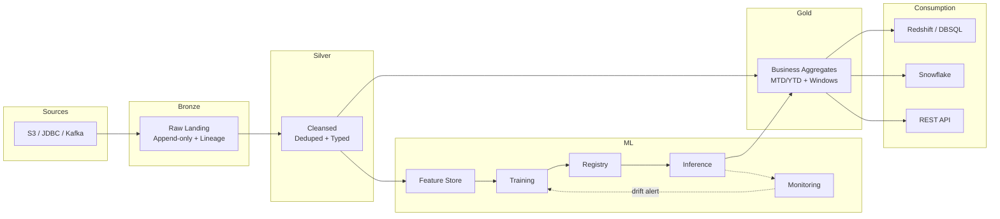

<div align="center">

# 🏗️ Data Platform Blueprint

### Production-grade template for AWS & Databricks

*Clone it. Fill the placeholders. Ship your data platform.*

[](LICENSE)
[](https://python.org)
[](https://spark.apache.org)
[](#)
[](#)

<br/>

**283 files** · **98 Python** · **130 Docs** · **Dual Platform** · **MIT Open Source**

---

[Quick Start](#-quick-start) · [Architecture](#-architecture) · [What's Inside](#-whats-inside) · [How to Use](#-how-to-use) · [Best Practices](#-best-practices)

</div>

---

## 🚀 Quick Start

```bash
# 1. Clone
git clone https://github.com/toretto17/data-platform-blueprint.git my-project
cd my-project

# 2. Pick your platform (delete the one you don't need)
ls aws/         # ← AWS (Glue + SageMaker + boto3)
ls databricks/  # ← Databricks (Delta + Unity Catalog + MLflow)

# 3. Configure your environment
cp configs/templates/project.yaml.template configs/dev/project.yaml
# Fill: account_id, buckets, roles, region

# 4. Copy a template, fill CHANGE_ME, run
# Example: build a Silver ETL job
cp aws/src/silver/jobs/silver_job.py my_silver_sales.py
# Search "CHANGE_ME" → fill your table names, transforms, DQ checks

# 5. Deploy
make deploy-glue ENV=dev          # AWS
databricks bundle deploy -t dev   # Databricks
```

---

## 🏛️ Architecture



<details>
<summary>📋 <b>Load Patterns Included</b> (click to expand)</summary>

| Pattern | When to use | File |
|---|---|---|
| 🔄 **Incremental** | Source has a watermark column | `de_patterns/incremental_load.py` |
| 📦 **Full Load** | Small table / no watermark | `de_patterns/full_load.py` |
| 🔀 **CDC / CDF** | Row-level inserts/updates/deletes | `de_patterns/cdc_load.py` |
| 📝 **SCD Type 1** | Overwrite (no history needed) | `de_patterns/scd_type1.py` |
| 📚 **SCD Type 2** | Full history with effective dates | `de_patterns/scd_type2.py` |

</details>

---

## 📂 Repository Structure

```
data-platform-blueprint/
│
├── 📁 aws/                    ← Self-contained AWS tree
│   └── src/
│       ├── ingestion/         Batch (S3/JDBC) + Streaming (Kinesis/Kafka)
│       ├── bronze/            Raw landing + lineage + DQ
│       ├── silver/            Cleanse, dedup, cast + DQ
│       ├── gold/              Aggregations, windows, zero-fill + DQ
│       ├── consumption/       Redshift, Snowflake, REST API
│       ├── de_patterns/       CDC, SCD1, SCD2, incremental, full
│       ├── feature_store/     Create, ingest, validate (SageMaker FS)
│       ├── mlops/             Train → Eval → Register → Deploy → Monitor
│       ├── data_science/      Forecasting, Classification, Regression, Anomaly
│       ├── orchestration/     Step Functions, EventBridge, Airflow
│       └── common/            Logging, DQ, secrets, metadata, utils
│
├── 📁 databricks/             ← IDENTICAL structure (Delta + UC + MLflow)
│
├── 📁 infrastructure/         Terraform, IAM, Databricks Asset Bundles
├── 📁 configs/                Environment configs (dev/qa/uat/prod)
├── 📁 docs/                   Architecture, runbooks, onboarding
├── 📁 templates/              Starter files (pointers to full code)
├── 📁 tests/                  Unit + integration tests
├── 📁 cicd/                   GitHub Actions + CodeBuild
└── 📁 monitoring/             Alerts, dashboards, metrics
```

> **Key design:** `aws/` and `databricks/` have **identical folder structure + file names**. Pick one, delete the other. No cross-dependencies.

---

## 📦 What's Inside

<details>
<summary>🔧 <b>Data Engineering</b> (click to expand)</summary>

| Capability | File (same name in both trees) | Highlights |
|---|---|---|
| Batch Ingestion | `ingestion/batch/batch_ingest.py` | S3/JDBC + Secrets Manager / secret scopes |
| Stream Ingestion | `ingestion/streaming/stream_ingest.py` | Kinesis/Kafka/Autoloader + checkpoints |
| Bronze Layer | `bronze/jobs/bronze_job.py` | Append-only, lineage cols, schema evolution |
| Silver Layer | `silver/jobs/silver_job.py` | BaseSilverJob — dedup, cast, DQ, early-exit |
| Gold Layer | `gold/marts/gold_job.py` | Windows (MTD/YTD), zero-fill, round floats |
| Consumption | `consumption/{jobs,warehouse,snowflake,apis}/` | Redshift Spectrum, DBSQL, Snowflake MERGE, FastAPI |
| CDC / CDF | `de_patterns/cdc_load.py` | Delta CDF (batch+stream) / DMS + bookmarks |
| SCD Type 2 | `de_patterns/scd_type2.py` | Two-step MERGE, effective dates, NULL-safe |

</details>

<details>
<summary>🤖 <b>MLOps (Full Lifecycle)</b> (click to expand)</summary>

| Stage | File | What it does |
|---|---|---|
| 🏋️ Training | `mlops/training/training_pipeline.py` | Feature Store → train → eval gate → register |
| 📊 Evaluation | `mlops/evaluation/evaluate.py` | Threshold gate (F1/AUC), metrics report |
| 🎯 Inference | `mlops/inference/inference.py` | Batch (score_batch/Transform) + Realtime (endpoint) |
| 📋 Registry | `mlops/registry/registry.py` | UC aliases / SageMaker Package Groups |
| 🚀 Deployment | `mlops/deployment/deployment.py` | Canary (traffic split) + instant rollback |
| 👁️ Monitoring | `mlops/monitoring/monitoring.py` | Lakehouse Monitor / Model Monitor + PSI/KS drift |
| 🔗 Pipelines | `mlops/pipelines/ml_pipeline.py` | SageMaker @step / Databricks Workflows |

</details>

<details>
<summary>🔬 <b>Data Science</b> (click to expand)</summary>

| Domain | File | Key features |
|---|---|---|
| 📈 Forecasting | `data_science/forecasting/forecasting.py` | Prophet + LightGBM, temporal split, MAPE/SMAPE |
| 🏷️ Classification | `data_science/classification/classification.py` | Optuna HPO, stratified split, SHAP, F1/AUC |
| 📉 Regression | `data_science/regression/regression.py` | Model comparison leaderboard, SHAP, Optuna |
| 🚨 Anomaly Detection | `data_science/anomaly_detection/anomaly_detection.py` | IsolationForest per-segment, normalize [0,1] |
| 🧪 Experimentation | `data_science/experimentation/experimentation.py` | OptunaMLflowCallback, quick_tune(), ExperimentManager |
| ⚙️ Feature Engineering | `data_science/feature_engineering/feature_engineering.py` | Lags, rolling stats, calendar, cyclical encoding |

</details>

---

## ⚡ Platform Comparison

| Concept | AWS | Databricks |
|:---|:---|:---|
| ETL Engine | Glue (Spark) | Databricks Runtime |
| Catalog | Glue Data Catalog | Unity Catalog |
| Table Format | Parquet / Delta / Iceberg | Delta Lake |
| Feature Store | SageMaker FeatureGroup | UC feature table (Delta + PK) |
| Model Registry | Model Package Groups + Approve | MLflow + UC aliases (Champion) |
| Serving (batch) | Batch Transform | `fe.score_batch` |
| Serving (realtime) | Serverless Inference | Model Serving (scale-to-zero) |
| Monitoring | Model Monitor + CloudWatch | Lakehouse Monitor + MLflow |
| CDC | DMS + Job Bookmarks | Delta Change Data Feed |
| HPO | Optuna (portable) | Optuna (recommended over Hyperopt) |
| Orchestration | Step Functions + EventBridge | Databricks Workflows |
| IaC | Terraform | Terraform + Asset Bundles |

---

## 🛠️ How to Use

```
Step 1: Clone the repo
Step 2: Delete the platform you DON'T use (rm -rf databricks/ or rm -rf aws/)
Step 3: Fill configs/<env>/project.yaml (account, buckets, roles)
Step 4: Copy a template file → search CHANGE_ME → fill your values
Step 5: Override the abstract methods (your business logic)
Step 6: make lint test (validate)
Step 7: Deploy (Terraform / DAB / make deploy-glue)
```

### Finding what you need

| I want to... | Look at... |
|---|---|
| Build a new ETL pipeline | `docs/runbooks/HOWTO_ADD_NEW_ETL_PIPELINE.md` |
| Train + deploy a model | `docs/runbooks/HOWTO_ADD_NEW_MODEL.md` |
| Set up SCD2 history | `docs/runbooks/HOWTO_ADD_SCD2_TABLE.md` |
| Add Feature Store | `docs/runbooks/HOWTO_SETUP_FEATURE_STORE.md` |
| Initial load / backfill | `docs/runbooks/HOWTO_INITIAL_LOAD_AND_BACKFILL.md` |
| Deploy to new account | `docs/runbooks/HOWTO_DEPLOY_TO_NEW_ACCOUNT_OR_WORKSPACE.md` |
| Understand the full flow | `docs/architecture/END_TO_END_FLOW.md` |
| Compare AWS vs Databricks | `docs/architecture/AWS_VS_DATABRICKS_MAPPING.md` |

---

## ✅ Best Practices Enforced

| Practice | How it's enforced |
|:---|:---|
| 🔒 No hardcoded secrets | Fail-fast on missing args (never silent nonprod fallback) |
| 🔄 Idempotent | MERGE/upsert, dynamic partition overwrite, freshness guards |
| 💰 Cost-effective | Early-exit, scale-to-zero, spot instances, AQE, skip-if-fresh |
| 🧪 DQ at every layer | Warn+skip pattern (never crash on missing rulesets) |
| ⏱️ No future leakage | Temporal splits, window `ROWS PRECEDING` only |
| 🎯 Round floats | 2dp before every write |
| 🔍 Optuna for HPO | Not deprecated Hyperopt (Databricks 2025+ recommendation) |
| 🔀 CDC via Delta CDF | Batch + streaming with checkpoint (exactly-once) |
| 📚 SCD2 two-step MERGE | MergeKey trick, NULL-safe `<=>` change detection |
| 🐛 Production bug-patterns | Documented and guarded in code (10+ patterns) |

---

## 📊 Project Status

See [`ROADMAP.md`](ROADMAP.md) for the full task tracker.

```
Phases complete: 14/14 (100%)
Items tracked:   209/209
Python files:    98
Documentation:   130 files
Total:           283 files
```

---

## 🤝 Contributing

See [`CONTRIBUTING.md`](CONTRIBUTING.md) for conventions, PR workflow, and how to add new templates.

---

## 📄 License

[MIT](LICENSE) — open and reusable. Use it anywhere, for anything.

---

<div align="center">

**Built with ❤️ for the data engineering community**

*If this helped you, give it a ⭐*

</div>
