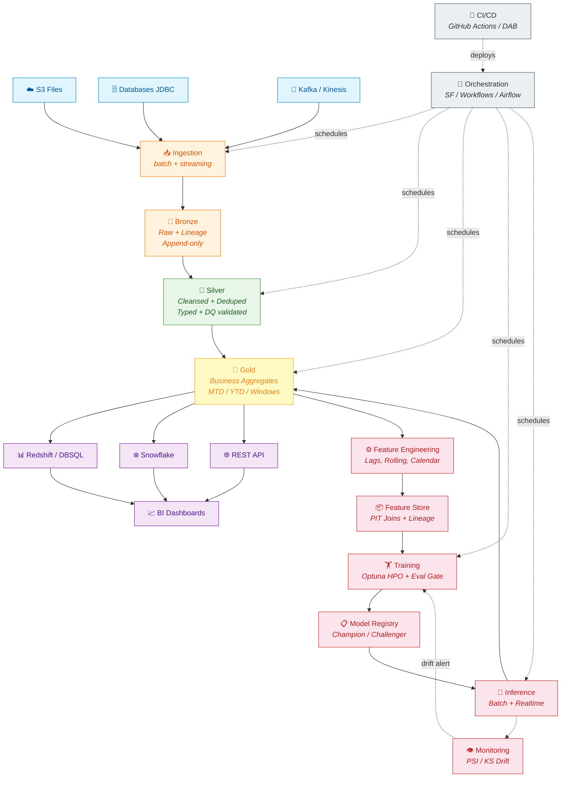
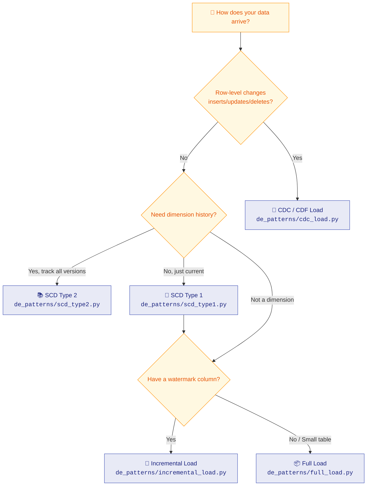
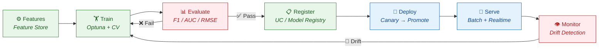

<div align="center">

# 🏛️ End-to-End Architecture

*How data flows through the platform — from raw sources to ML predictions*

</div>

---

## 🗺️ High-Level Data Flow



---

## 🔀 Load Patterns (Decision Matrix)



---

## 🤖 MLOps Lifecycle



---

## 🔗 How Components Connect

| From | To | How |
|:---|:---|:---|
| **Gold** → Feature Store | `fe.write_table` / `FeatureStoreManager.ingest_data` | Scheduled job computes + writes features |
| **Feature Store** → Training | `fe.create_training_set` + `FeatureLookup` | Auto PIT-join on timestamp columns |
| **Training** → Registry | `fe.log_model` (Databricks) / `create_model_package` (AWS) | Packages feature lineage INTO the model |
| **Registry** → Inference | `fe.score_batch(model_uri)` / Batch Transform from latest Approved | Auto-fetches features at inference time |
| **Inference** → Consumption | Output predictions → Gold table → consumption ETL | Merged with actuals for BI |
| **Monitoring** → Training | Drift alert (PSI > 0.2) → triggers retrain pipeline | Closes the feedback loop |

---

## 🏗️ Platform-Specific Implementation

<table>
<tr>
<th width="50%">☁️ AWS (Glue + SageMaker)</th>
<th width="50%">🧱 Databricks (Delta + UC + MLflow)</th>
</tr>
<tr>
<td>

```
EventBridge (cron)
    → Step Functions (DAG)
        → Glue Jobs (Spark ETL)
            → S3 (Parquet/Delta)
                → Glue Catalog
                    → Athena / Redshift

SageMaker Pipelines (@step)
    → Training → Eval → Register
        → Batch Transform
            → Model Monitor
```

</td>
<td>

```
Databricks Workflows (cron)
    → Notebook Tasks (Spark ETL)
        → Delta Tables
            → Unity Catalog
                → DBSQL / Snowflake

MLflow + FeatureEngineeringClient
    → Training → Eval → Register (UC)
        → Model Serving (scale-to-zero)
            → Lakehouse Monitor
```

</td>
</tr>
</table>

---

## 📐 Best Practices Embedded in Architecture

| Layer | Practice | Why |
|:---|:---|:---|
| Bronze | Append-only + lineage | Never lose raw data; full audit trail |
| Silver | Dedup + DQ before downstream | Garbage in ≠ garbage out |
| Gold | Dynamic partition overwrite | Idempotent; safe to re-run |
| Feature Store | PIT joins (no future leakage) | ML correctness |
| Training | Eval gate before registration | Bad models never reach production |
| Deployment | Canary first, rollback ready | Minimize blast radius |
| Monitoring | PSI/KS drift detection | Catch degradation before users do |
| All layers | Early-exit (skip if fresh) | Save compute $$ on no-op runs |
